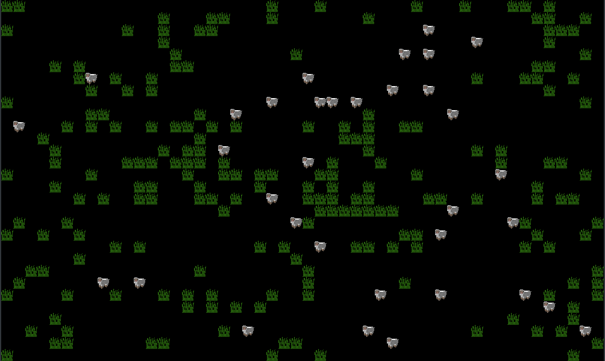

## General info
This project was made for an OOP class. This application creates world for sheeps, that eat grass, breed and died. Movement is random.
	
## Technologies
Project is created with:
* Java 11.0.4
* Json-simple 1.1.1
* JUnit 5.4 (for tests)

## Setup
To run this project, compile and run class src/agh/cs/project1/visualization/Visualization.java

## Settings
Simple settings are in the file src/parameters.json:
* width - world width
* height - world height
* startEnergy - amount of energy sheep start with
* moveEnergy - the amount of energy needed to move
* plantEnergy - the amount of energy that eating plants restore
* jungleRatio - size of the jungle (0.0 - 1.0)
* scale - size of the window
* animalsAtBeginning - number of sheep at the beginning
* periodInterval - length of the day in ms

